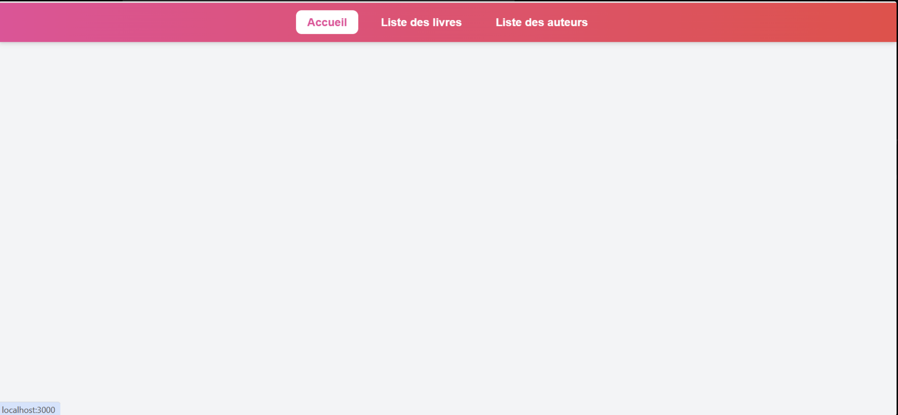
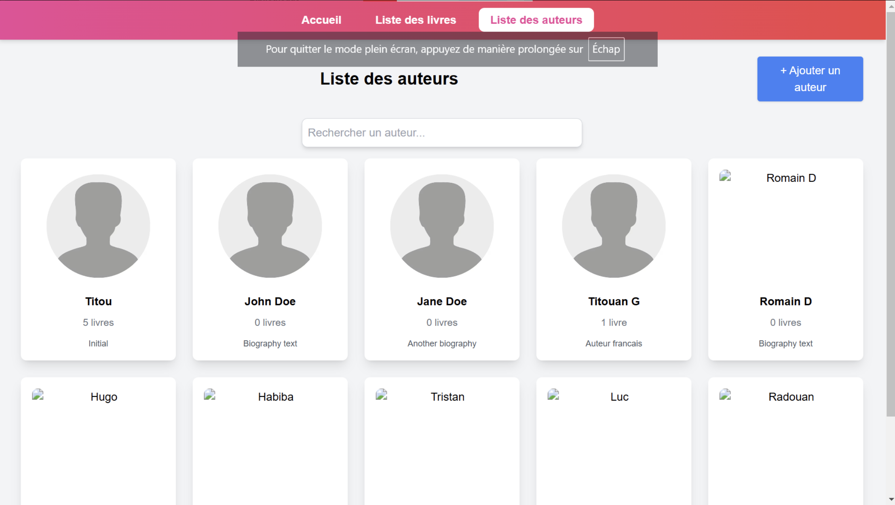
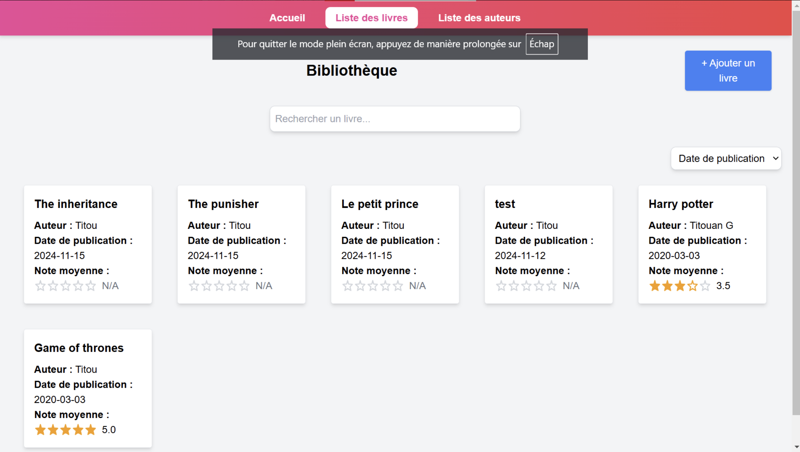

# TechnoWeb
## Initialisation du projet

### Création d'un environnement virtuel
"python3 -m venv techno-web"
"source techno-web/bin/activate"

### Installation des dépendances requises
"npm install --save $(cat requirements.txt)"

## Pages du projet

### Page d'Accueil
Voici un aperçu de la page d'accueil du projet :

### Page des Auteurs
Voici un aperçu de la page des auteurs :

### Page des Livres
Voici un aperçu de la page des livres :

